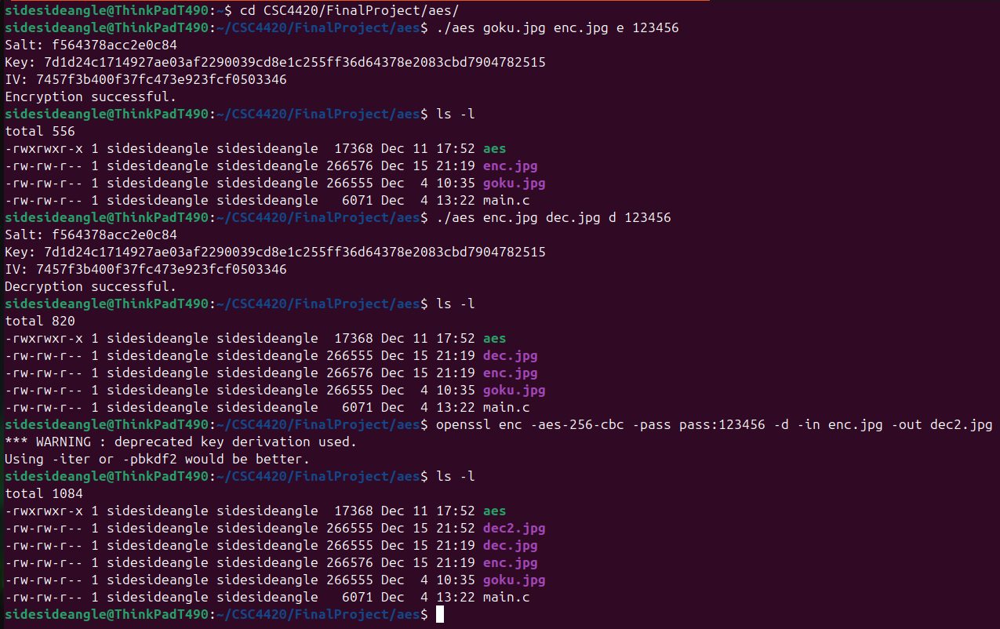

# Standalone AES-256-CBC Encryption Tool

A small, dependency-light C command-line tool for AES-256-CBC file encryption and
decryption, built to be byte-compatible with OpenSSL's `enc` command. This was built as
a correctness testbed — to validate key derivation, salt handling, and block-cipher
processing in isolation — before that same logic was integrated into a larger project
(see [../README.md](../README.md) for the s3fs-fuse encrypted-filesystem project this
supports).

## Why a standalone tool first

Debugging cryptographic logic inside a large, multi-threaded FUSE filesystem is painful —
failures show up as corrupted files with no clear signal of whether the bug is in the
crypto, the buffering, or the upload pipeline itself. Building this tool first made it
possible to verify the key derivation and encrypt/decrypt round-trip against real OpenSSL
output before writing any of that logic into the production codebase.

## Compatibility

Output is compatible with the OpenSSL command line:

```bash
# Files produced by this tool can be decrypted with OpenSSL directly:
openssl enc -d -aes-256-cbc -salt -in file.enc -out file.dec -pass pass:yourpassword

# And vice versa:
openssl enc -aes-256-cbc -salt -in file.txt -out file.enc -pass pass:yourpassword
./aes file.enc file.dec2 d yourpassword
```

This works because the tool uses OpenSSL's own `EVP_BytesToKey` key derivation and writes
the same `Salted__` + 8-byte-salt header OpenSSL's `enc` command uses.

## Build

```bash
gcc main.c -o aes -lcrypto
```

(Requires OpenSSL development headers: `sudo apt install libssl-dev`.)

## Usage

```bash
./aes <inputFile> <outputFile> <e|d> <password> [nosalt]
```

- `e` — encrypt `inputFile` into `outputFile`
- `d` — decrypt `inputFile` into `outputFile`
- `nosalt` — optional; omit to use salt (default and recommended), pass `nosalt` to
  disable it

### Examples

```bash
# Encrypt with salt (default)
./aes secret.txt secret.enc e mypassword

# Decrypt
./aes secret.enc secret.dec d mypassword

# Encrypt without salt
./aes secret.txt secret.enc e mypassword nosalt
```

### Demo — cross-compatibility with OpenSSL

Encrypting with this tool, then decrypting the *same file* two ways: once with the tool
itself, once with `openssl enc` directly. Both recover the identical original file,
confirming the two are wire-compatible:



Testing summary (salt and no-salt, encrypt and decrypt) — all passed:

| Test | Result |
|---|---|
| Salted encrypt | Pass |
| Salted decrypt | Pass |
| No-salt encrypt | Pass |
| No-salt decrypt | Pass |

## How it works

- Uses `EVP_BytesToKey` with SHA-256 to derive a 256-bit key and 128-bit IV from the
  password (and salt, if enabled) — matching OpenSSL's default KDF for `aes-256-cbc`.
- When salting is enabled, generates an 8-byte random salt with `RAND_bytes`, writes the
  standard `Salted__` magic header followed by the salt, then the ciphertext — the same
  layout OpenSSL's `enc` produces.
- Streams the file through `EVP_EncryptUpdate`/`EVP_DecryptUpdate` in 1024-byte chunks
  rather than loading the whole file into memory, so it scales to large files.

## Known limitations

- Password is passed as a plain command-line argument, which is visible in shell history
  and process listings (`ps`). Fine for local testing; not intended as a production CLI
  security tool.
- No integrity/authentication check (this is CBC, not an AEAD mode like GCM) — a corrupted
  or tampered ciphertext will decrypt to garbage without any error.

## License

MIT (or update to match your preferred license).
